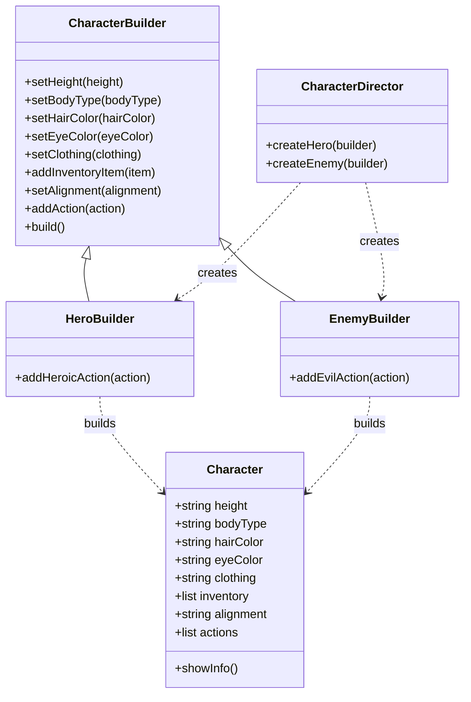

# Діаграма Будівельник

```mermaid
classDiagram
    direction TB

    class Character {
        +string height
        +string bodyType
        +string hairColor
        +string eyeColor
        +string clothing
        +list inventory
        +string alignment
        +list actions
        +showInfo()
    }

    class CharacterBuilder {
        +setHeight(height)
        +setBodyType(bodyType)
        +setHairColor(hairColor)
        +setEyeColor(eyeColor)
        +setClothing(clothing)
        +addInventoryItem(item)
        +setAlignment(alignment)
        +addAction(action)
        +build()
    }

    class HeroBuilder {
        +addHeroicAction(action)
    }

    class EnemyBuilder {
        +addEvilAction(action)
    }

    class CharacterDirector {
        +createHero(builder)
        +createEnemy(builder)
    }

    CharacterBuilder <|-- HeroBuilder
    CharacterBuilder <|-- EnemyBuilder

    CharacterDirector ..> HeroBuilder : creates
    CharacterDirector ..> EnemyBuilder : creates

    HeroBuilder ..> Character : builds
    EnemyBuilder ..> Character : builds
```
