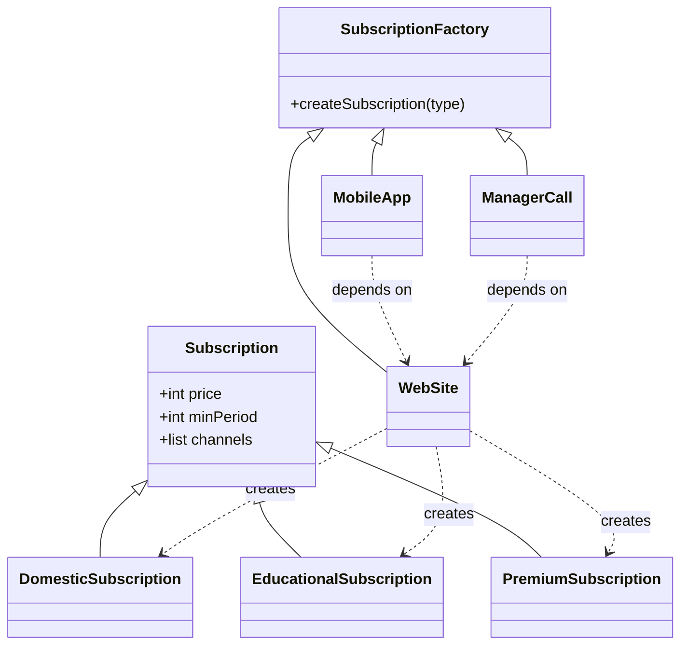

# Діаграма Фабричний метод

```mermaid
classDiagram
    direction TB

    class Subscription {
        +int price
        +int minPeriod
        +list channels
    }

    class DomesticSubscription
    class EducationalSubscription
    class PremiumSubscription
    class SubscriptionFactory {
        +createSubscription(type)
    }
    class WebSite
    class MobileApp
    class ManagerCall

    Subscription <|-- DomesticSubscription
    Subscription <|-- EducationalSubscription
    Subscription <|-- PremiumSubscription

    SubscriptionFactory <|-- WebSite
    SubscriptionFactory <|-- MobileApp
    SubscriptionFactory <|-- ManagerCall

    WebSite ..> DomesticSubscription : creates
    WebSite ..> EducationalSubscription : creates
    WebSite ..> PremiumSubscription : creates

    MobileApp ..> WebSite : depends on
    ManagerCall ..> WebSite : depends on
```
